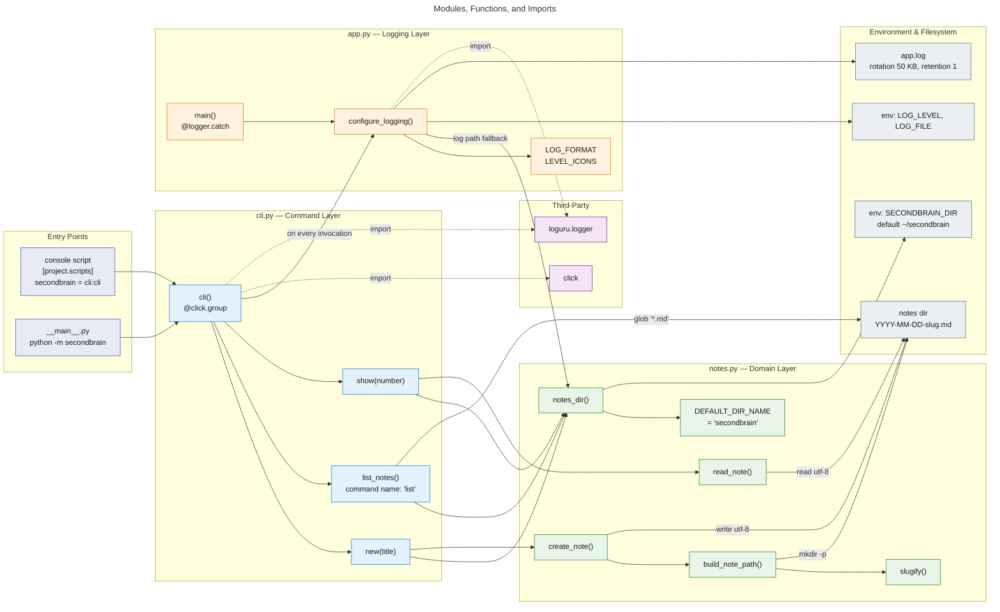
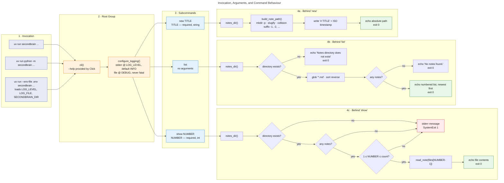

# Architecture

Three views of the same small package: what the modules are, how you enter them, and
what a typical session looks like.

## 1. Package Overview

Every module, the functions inside it, and how they connect.

- **Solid arrows** — call flow / data flow at runtime
- **Dotted arrows** — module-level imports

!!! note "Layering"
    `cli.py` depends on `app.py` and `notes.py`; `app.py` depends on `notes.py` (only for
    the default log location). `notes.py` imports nothing from the package — it is the leaf.

## 2. Entry Points and Arguments

What you can type, which arguments each command takes, and what runs behind it.

!!! warning "Exit codes differ between `list` and `show`"
    `list` treats a missing directory or an empty result as a normal outcome and exits `0`.
    `show` treats the same conditions as errors: it writes to stderr and exits `1`.

## 3. Example User Flow

A first session: capture two notes with the same title, list them, read one back.

```mermaid
---
title: Typical Session — capture, list, read
---
flowchart LR
    subgraph STEP1["Step 1 · Capture"]
        direction TB
        U1["$ secondbrain new 'Café ideas'"]
        P1["slugify → 'cafe-ideas'<br>accents folded to ASCII"]
        F1["created<br>2026-08-02-cafe-ideas.md"]
    end

    subgraph STEP2["Step 2 · Capture again, same title"]
        direction TB
        U2["$ secondbrain new 'Café ideas'"]
        P2["path taken → append counter"]
        F2["created<br>2026-08-02-cafe-ideas-1.md"]
    end

    subgraph STEP3["Step 3 · Review"]
        direction TB
        U3["$ secondbrain list"]
        P3["glob '*.md' · sort reverse"]
        O3["1. 2026-08-02-cafe-ideas.md<br>2. 2026-08-02-cafe-ideas-1.md"]
    end

    subgraph STEP4["Step 4 · Read back"]
        direction TB
        U4["$ secondbrain show 1"]
        P4["index 1 → files[0]"]
        O4["# Café ideas<br><br>2026-08-02T18:29:23"]
    end

    subgraph SIDE["Throughout · Side effects"]
        direction TB
        DISK["~/secondbrain/<br>plain markdown, nothing else"]
        LOGS["~/secondbrain/app.log<br>DEBUG lines for every command"]
    end

    U1 --> P1 --> F1
    F1 --> U2
    U2 --> P2 --> F2
    F2 --> U3
    U3 --> P3 --> O3
    O3 --> U4
    U4 --> P4 --> O4

    F1 -.-> DISK
    F2 -.-> DISK
    P3 -.-> LOGS
    P4 -.-> LOGS

    classDef cmd fill:#e3f2fd,stroke:#1976d2,color:#1a1a1a
    classDef proc fill:#fff3e0,stroke:#ef6c00,color:#1a1a1a
    classDef out fill:#e8f5e9,stroke:#2e7d32,color:#1a1a1a
    classDef side fill:#eceff1,stroke:#546e7a,color:#1a1a1a

    class U1,U2,U3,U4 cmd
    class P1,P2,P3,P4 proc
    class F1,F2,O3,O4 out
    class DISK,LOGS side
```

!!! tip "Why `-1` is listed second"
    Listing is a reverse sort of filenames. `2026-08-02-cafe-ideas.md` sorts after
    `2026-08-02-cafe-ideas-1.md` (`.` > `-`), so the original lands at position 1 and the
    collision-suffixed copy at position 2. The numbers in `list` are positions in that
    sorted view, not stable IDs — they shift as notes are added.
